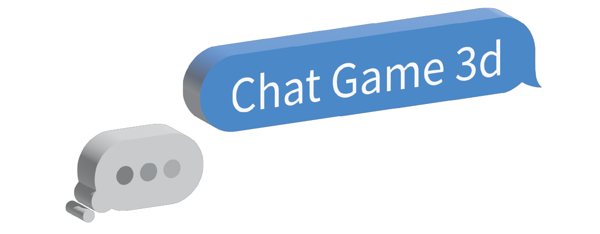
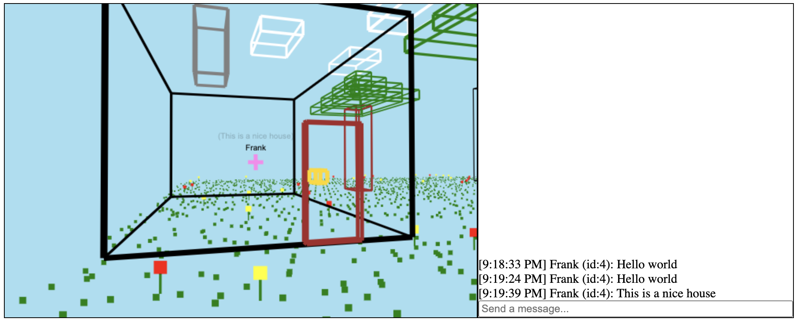
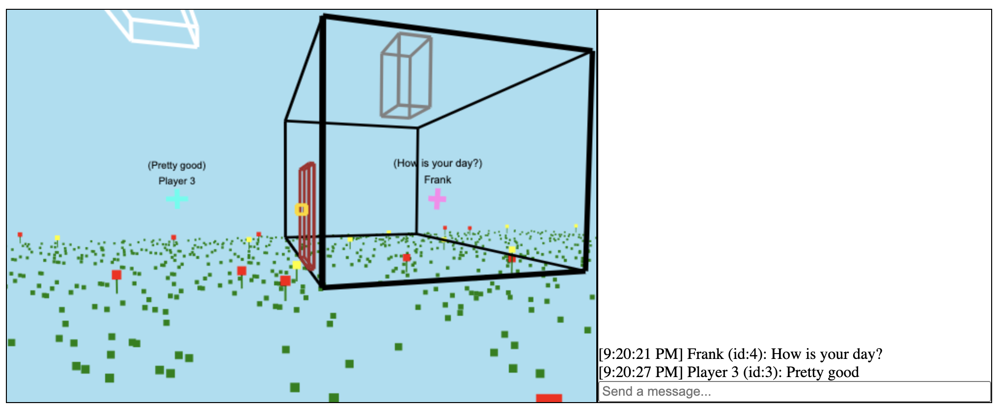
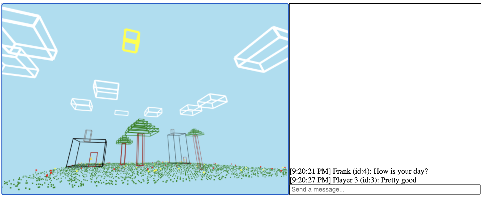

[](https://chat-game-3d.herokuapp.com/)

# Chat Game 3d

Why chat in 2d when you can chat in 3d?

<h1 align="center">
    <a href="https://chat-game-3d.herokuapp.com/"></a>
</h1>

# Features

- Real-time chat in 3d and 2d environment
- Lovely 3d environment (with flowers, trees, clouds, and more!)
- Adjustable camera settings





# About
I created this project with inspiration from my linear algebra class. It started as a small rendering engine I created from scratch while learning about camera transformation matricies. Later, a friend told me that I should make something more interesting than just a rendering engine, so I decided to explore websockets.

# Tech stack

<p>
    
    
    
    
    
    
</p>


| Frontend |
|---       |
| Typescript    |
| SocketIO |
| Webpack |

| Backend |
|---       |
| Node.js    |
| Express    |
| SocketIO |

| DevOps |
|---       |
| Heroku    |

# Local Development

## Setting up the backend

Requirements: `node`, `npm`

Clone the repository and install npm packages in backend:
```
cd backend
npm install
```

Start the app:
```
npm run dev
```
Visit `https://localhost:3001/`

Done!

## Setting up the frontend (optional)
Install npm packages in frontend:
```
cd frontend
npm install
```
Start the frontend
```
npm start
```
Visit `https://localhost:3000/` (Note: The backend must be running!)

Done!
